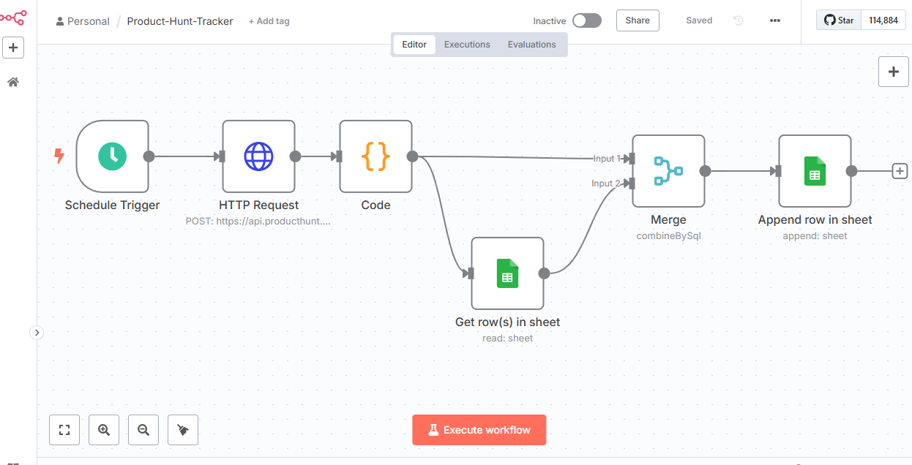
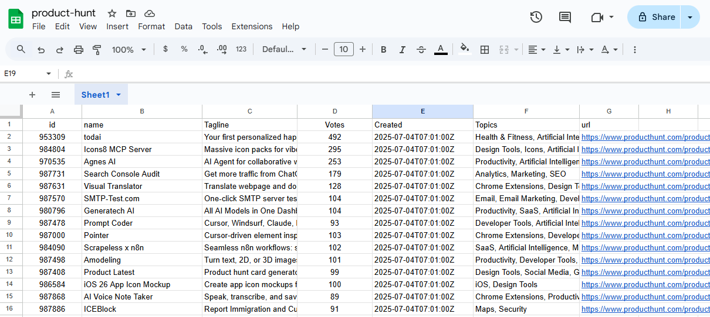

# 🚀 Product Hunt Tracker (n8n + GraphQL + Google Sheets)

This workflow automates the daily tracking of new product launches on [Product Hunt](https://www.producthunt.com/) using GraphQL and stores the results in a Google Sheet. It includes full deduplication logic to avoid inserting the same post more than once.

---

## 📌 Features

- ✅ Uses Product Hunt's **GraphQL API** to fetch latest launches
- ✅ Authenticates with **OAuth2** (via `ngrok` tunnel)
- ✅ Processes and flattens complex nested GraphQL data
- ✅ Checks against existing **Google Sheet** rows
- ✅ **Deduplicates** by `id` using SQL-style logic
- ✅ Appends new posts with clean mapping
- ✅ Schedule-ready (daily run at 2:00 PM)

---

## 🧰 Tools & Technologies

- [n8n](https://n8n.io/) – Automation workflow engine (self-hosted)
- Product Hunt GraphQL API – Data source
- OAuth2 – Secure authentication
- `ngrok` – Public tunnel for OAuth redirect
- Google Sheets – Final destination for post data

---

## 🔁 Workflow Overview

1. **Trigger** – Manual or Scheduled (daily @ 14:00)
2. **HTTP Request** – POST GraphQL query to Product Hunt
3. **Code Node** – Flattens nested data:
   - `id`, `name`, `tagline`, `votesCount`, `createdAt`, `topics[]`, `url`
4. **Get Rows** – Pulls all existing entries from Google Sheet
5. **Merge Node** – SQL-like join and filter:
   ```sql
   SELECT * FROM input1
   LEFT JOIN input2 ON input1.id = input2.id
   WHERE input2.id IS NULL
   ```
6. **Append Row** – Adds only new items to the Sheet

---

## 🗃️ Google Sheet Structure

```
id | name | tagline | votes | created | topics | url
```

---

## 📸 Screenshots

### 🔧 n8n Workflow



### 📄 Final Output Sheet



---

## 💡 Use Cases

- Curate daily **Product Hunt** summaries
- Power startup launch dashboards
- Feed newsletter / Notion / Airtable lists
- Perform trend analysis on `topics`, `votes`, or launch time

---

## 🔐 Auth Setup Tips

- Create a Product Hunt OAuth2 App
- Set the redirect URI to your `ngrok` tunnel + `/rest/oauth2-credential/callback`

---

## 📦 Files

- `workflow.json` – Full export of the automation
- `screenshots/` – Visuals of flow and output

---

## 🧠 Author Notes

This is a portfolio-ready automation that demonstrates modern API integration, GraphQL handling, and real-time deduplication using n8n's visual + code features.

Use it, fork it, or extend it into Slack, Airtable, Notion, and more. ✨

---

**Built by:** Ashraf @ [n8n Freelance Automations]

